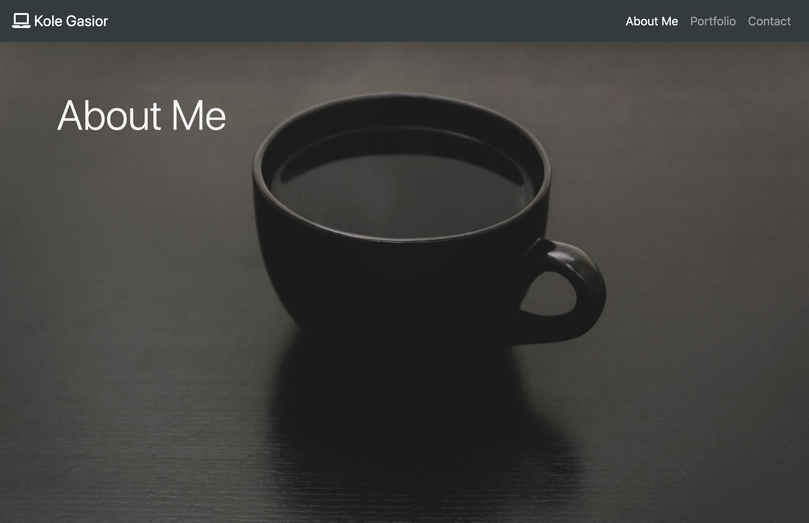
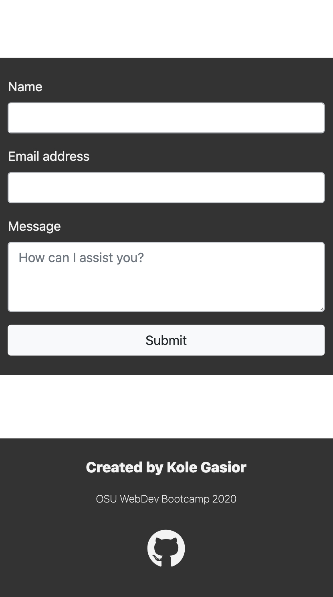

# My Portfolio

## Description

My personal portfolio created with Twitter Bootstrap.
Includes the following web pages:

- About Me
  - Contains description about me, link to my resume, and links to various certifications I have earned.
- Portfolio
  - Contains links to deployed projects and respective Github repositories.
- Contact Form
  - Form to send me email via AWS SES

[View deployed project.](https://jkg-portfolio.herokuapp.com/)

## Visuals

### About Me

#### About Me: Small Screen View

### Portfolio

#### Portfolio: Small Screen View

### Contact Form

#### Contact Form: Small Screen View

